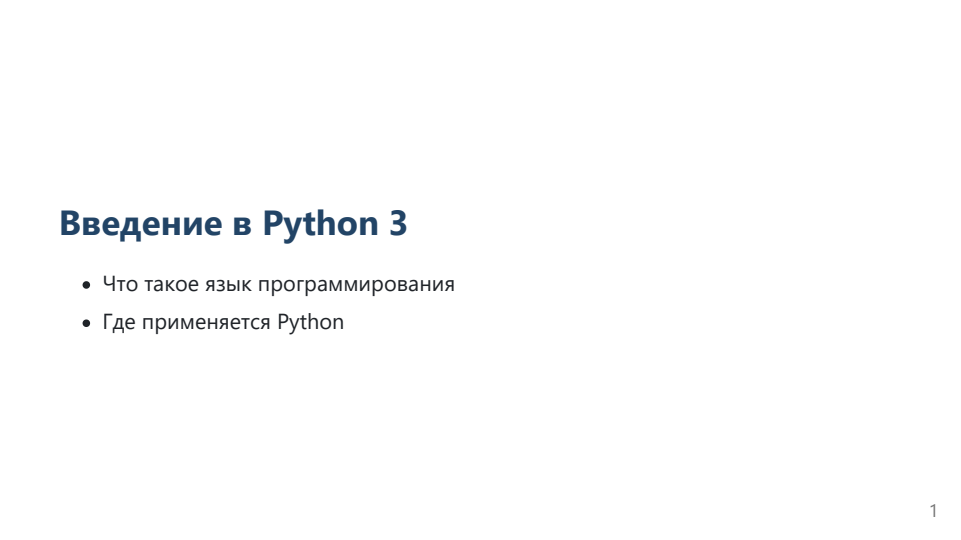

<div align="center">

# Slide Deck Generator

### Из плана занятия — в редактируемую презентацию

Markdown → Marp → **PPTX · PDF**

[](https://github.com/dimmmg/slide-deck-generator-practice/actions/workflows/tests.yml)
[](https://github.com/dimmmg/slide-deck-generator-practice/releases/latest)
[](#быстрый-старт)
[](#быстрый-старт)

[Быстрый старт](#быстрый-старт) · [Пример](#пример-результата) · [Команды](#параметры-cli) · [Документация](#документация)

</div>

---

## О проекте

**Slide Deck Generator** помогает преподавателю превратить Markdown-план занятия в черновик презентации. Заголовки становятся слайдами, тезисы, ссылки и код сохраняются, а TODO-пометки подсказывают, где стоит добавить пример или иллюстрацию.

Готовый PPTX можно открыть в PowerPoint или LibreOffice и доработать вручную. PDF удобен для просмотра и демонстрации. Генератор работает через локальный Python CLI.

> План остаётся источником для повторной генерации. Ручные правки презентации сохраняйте в отдельной копии PPTX.

### Возможности

| Возможность | Что получает пользователь |
|---|---|
| Разбор Markdown | Слайды по заголовкам и разделителям `---` |
| Сохранение содержимого | Кириллица, ссылки, вложенные списки и блоки кода |
| Редактируемый PPTX | Текст, который можно изменить после генерации |
| Дополнительный PDF | Версия презентации для просмотра |
| TODO-пометки | Подсказки для неполных слайдов, примеров и иллюстраций |
| Проверка входа | Диагностика ошибочных параметров и защита исходного файла |
| Сохранность экспортов | Подготовка во временной папке и откат при ошибке публикации |
| Метаданные и журнал | URI файлов, SHA-256 и локальные события xAPI |

## Пример результата

Ниже — реальный PPTX, созданный генератором. Заголовок изменён в PowerPoint на «Введение в Python 3», файл сохранён и повторно открыт.



Исходный план может выглядеть так:

```markdown
# Введение в Python
- Что такое язык программирования
- Где применяется Python

---

## Практика
- Создать переменную с именем
- Вывести приветствие на экран
```

Эта структура создаёт **два слайда**. Готовые примеры: [обычный урок](examples/lesson.md) и [код, вложенные списки и пустой слайд](examples/markdown-cases.md).

## Быстрый старт

### Требования

- **Python 3.13** и **Node.js 24** — версии, используемые в CI.
- **LibreOffice** — для редактируемого PPTX.
- **Chrome или Edge** — для экспорта Marp.
- **Git** — при установке через клонирование репозитория.

Пакеты Python из PyPI для работы CLI не требуются: генератор использует стандартную библиотеку. Зависимости Marp устанавливаются через npm.

### Установка и запуск в Windows

```powershell
git clone https://github.com/dimmmg/slide-deck-generator-practice.git
cd slide-deck-generator-practice

npm.cmd ci
python generate_slides.py --plan examples/lesson.md --output out --pdf
```

На Linux используйте `npm ci`. Автоматические тесты выполняются на Windows и Linux; реальная приёмка экспорта проведена на Windows.

<details>
<summary><strong>Node.js установлен, но команда node не найдена</strong></summary>

Откройте новое окно PowerShell. Если проблема сохраняется и Node установлен в стандартную папку:

```powershell
$env:Path = "C:\Program Files\nodejs;" + $env:Path
node --version
npm.cmd --version
```

Подробности — в [инструкции для Windows](docs/windows.md).

</details>

### Результаты запуска

```text
out/
├── lesson.marp.md        # Черновик Marp
├── lesson.pptx           # Редактируемая презентация
├── lesson.pdf            # PDF при запуске с --pdf
├── lesson.metadata.json # URI, число слайдов и SHA-256
└── events.xapi.jsonl     # История успешных генераций
```

## Сценарии работы

### 1. Подготовить презентацию

```powershell
python generate_slides.py --plan examples/lesson.md --output out --pdf
```

Откройте PPTX, проверьте содержание и TODO, внесите правки и сохраните отдельную копию, например `lesson-edited.pptx`.

### 2. Проверить план без конвертера

```powershell
python generate_slides.py --plan examples/lesson.md --output out --markdown-only
```

Этот режим создаёт только Marp Markdown. Node.js, Marp и LibreOffice для него не нужны; метаданные и событие экспорта не записываются.

### 3. Обновить занятие

Измените исходный Markdown, закройте открытые выходные файлы и повторите команду генерации. Новые экспорты заменят предыдущие, а в журнал добавится событие `regenerated`, если PPTX уже существовал.

### 4. Задать автора и идентификатор урока

```powershell
python generate_slides.py --plan examples/lesson.md --output out --pdf --actor teacher-demo --lesson-id urn:lesson:python-intro
```

`--actor` задаёт псевдоним в локальном событии. `--lesson-id` должен быть URI. Журнал не отправляется в удалённый LRS.

## Параметры CLI

```powershell
python generate_slides.py --help
```

| Параметр | Назначение | По умолчанию |
|---|---|---|
| `plan` или `--plan PATH` | Путь к Markdown; используйте один способ указания | Обязателен |
| `-o`, `--output PATH` | Папка результатов | `out` |
| `--pdf` | Создать PDF вместе с PPTX | Выключен |
| `--markdown-only` | Создать только Marp Markdown | Выключен |
| `--marp PATH` | Явный путь к конвертеру или `marp-cli.js` | Поиск локального Marp |
| `--actor NAME` | Псевдоним автора события | `student` |
| `--lesson-id URI` | Идентификатор занятия | URI исходного файла |
| `--mock-lrs` | Совместимый флаг; журнал всегда локальный | Не меняет режим записи |

Пути с пробелами заключайте в кавычки. Файл `.env` автоматически не загружается; настройки передаются аргументами CLI.

## Тестирование

```powershell
python -m unittest discover -s tests -v
```

| Проверка версии 1.0.0 | Результат |
|---|---|
| Автоматические тесты | **21 / 21** |
| GitHub Actions | Windows и Linux, Python 3.13, Node.js 24 |
| Реальный экспорт | Основной и расширенный примеры: по 3 слайда PPTX и страницы PDF |
| Метаданные | SHA-256 сверены с файлами |
| Повторная генерация | События `generated` / `regenerated`, история сохраняется |
| Редактирование PPTX | Изменение текста, сохранение копии и повторное открытие проверены |
| Сбой публикации | Проверено сохранение прежних экспортов при блокировке PDF |

Unit-тесты используют имитацию Marp. Реальный экспорт и редактирование проверяются отдельно по [чек-листу приёмки](docs/acceptance.md). Результаты релиза: [PR №18](https://github.com/dimmmg/slide-deck-generator-practice/pull/18).

### Команды Makefile

При установленном `make` доступны:

| Команда | Назначение |
|---|---|
| `make install` | Установить зависимости через `npm ci` |
| `make test` | Запустить unittest |
| `make demo` | Создать PPTX и PDF из примера урока |
| `make run-cli PLAN=examples/lesson.md OUTPUT=out` | Запустить генератор с указанными путями |

В Windows можно использовать прямые команды PowerShell выше — установка `make` не обязательна.

## Структура проекта

```text
slide-deck-generator-practice/
├── generate_slides.py       # CLI, парсер, экспорт, метаданные и события
├── examples/               # Обычный урок и сложные случаи Markdown
├── tests/test_generator.py # Автоматические проверки
├── docs/                   # Установка, архитектура, приёмка и ограничения
├── .github/workflows/      # CI для Windows и Linux
├── package.json            # Зависимости Marp
├── package-lock.json       # Воспроизводимая установка npm ci
├── Makefile                # Команды разработки
├── module.yaml             # Паспорт модуля
├── CHANGELOG.md            # История изменений
└── VERSION                 # Версия проекта
```

## Ограничения

- Редактируемый PPTX в Marp — экспериментальная возможность. Сложное оформление может потребовать ручной доработки.
- TODO — подсказки, которые нужно проверить автору занятия.
- Повторная генерация не переносит ручные правки из PPTX обратно в Markdown.
- Перед запуском закройте выходные файлы в Office: открытый файл может быть заблокирован для замены.
- Markdown обновляется до конвертации. Метаданные и журнал не входят в общую транзакцию с PPTX/PDF.
- Защита от отключения питания и параллельных запусков не реализована.

Подробнее — [гарантии сохранности и их границы](docs/reliability.md).

## Документация

| Документ | Содержание |
|---|---|
| [Требования](docs/requirements.md) | Задача проекта и критерии приёмки |
| [Windows](docs/windows.md) | Установка и запуск |
| [Markdown](docs/markdown.md) | Поддерживаемая разметка |
| [Экспорт](docs/export.md) | Режимы вывода и диагностика |
| [Архитектура](docs/architecture.md) | Компоненты и движение данных |
| [Сценарии](docs/use-cases.md) | Генерация, редактирование и обновление |
| [Метаданные и xAPI](docs/local-events.md) | Хеши, URI и локальный журнал |
| [Приёмка](docs/acceptance.md) | Проверка настоящего экспорта |
| [Демонстрация](docs/demo.md) | Сценарий показа проекта |
| [История изменений](CHANGELOG.md) | Возможности по версиям |

---

**Автор:** Горбовский Дмитрий Олегович · группа 14321-ДБ · 3 курс.

Учебный индивидуальный проект. [Репозиторий](https://github.com/dimmmg/slide-deck-generator-practice) · [Скачать релиз](https://github.com/dimmmg/slide-deck-generator-practice/releases/latest) · [Сообщить о проблеме](https://github.com/dimmmg/slide-deck-generator-practice/issues)
