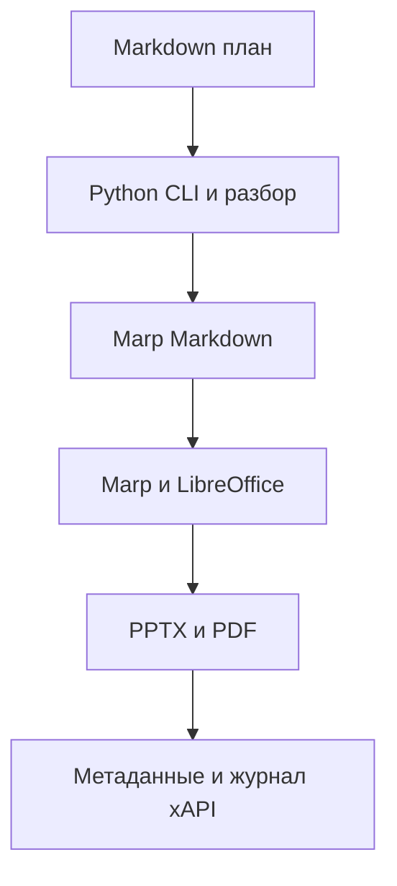

# Архитектура

Генератор выполняется локально. Python читает план, разбирает слайды и готовит
Marp Markdown. Marp через Node создаёт экспорт, LibreOffice участвует в
экспериментальном редактируемом PPTX. Python публикует результаты и пишет журнал.

Основные границы: исходный план, временный экспорт, выходная папка.
Удалённых сервисов, БД, веб-интерфейса и LRS нет.
